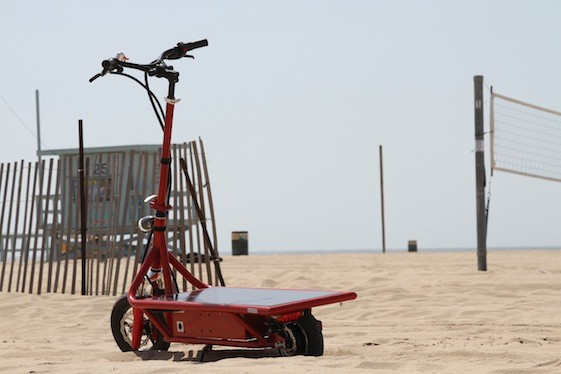
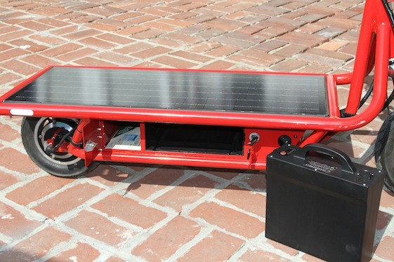
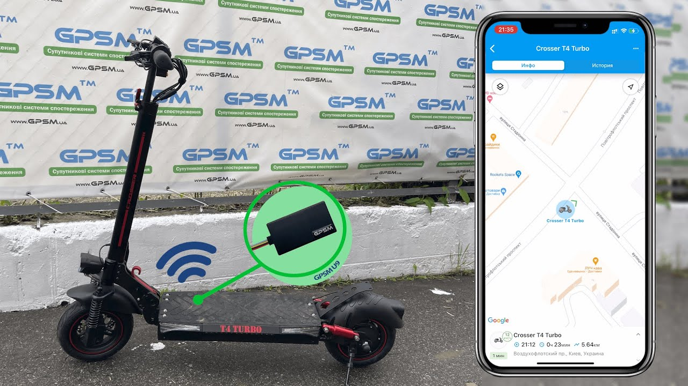
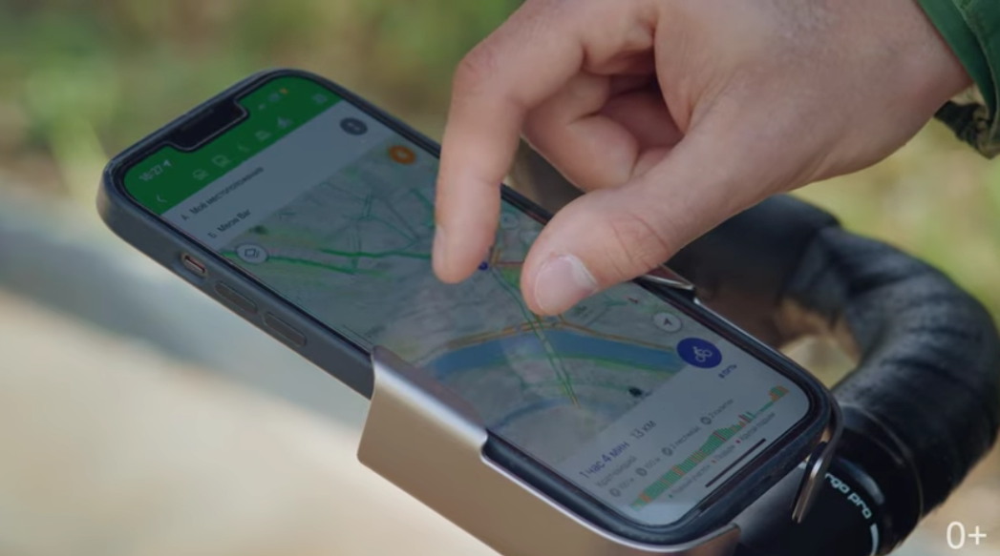
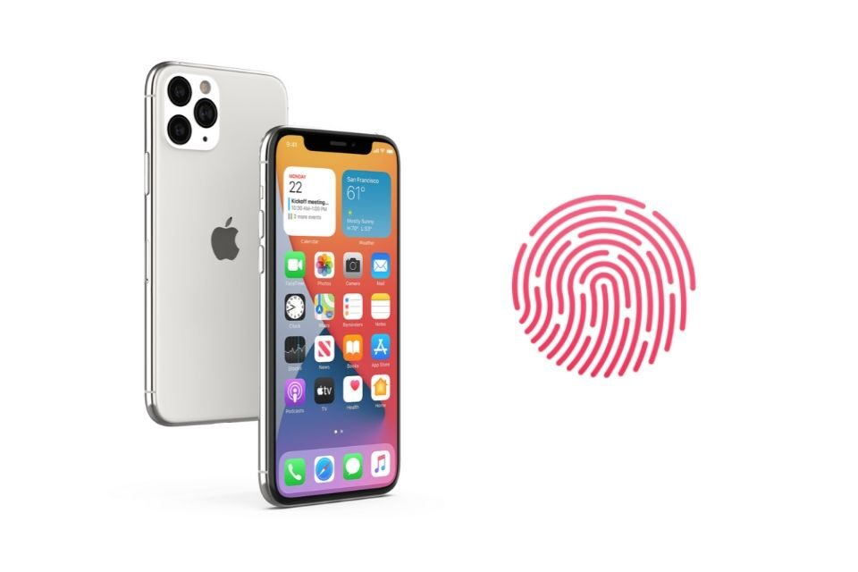

# Умный электросамокат!

## Идея:

### Запуск стартапа по прокату самокатов.
В рамках своего проекта мы
хотим создать электросамокат, который будет работать на солнечной батарейке, иметь
встроенный GPS-модуль, навигатор с картой города и отпечаток пальцев для активации самого
электросамоката.

## Прототип:

## Процесс разработки:

1. ### За основу берется обычный электосамокат.

  * _Продукт уже готов к использованию и не требует полной спецификации требований._

  * _Минимизируется время и усилия, затраченные на тестирование продукта._

  * _Позволяет привлечь к проекту реальных пользователей в качестве проводников, которые помогут скорректировать бизнес-модель и базовые характеристики будущего продукта._ 

  * _Тем самым мы получаем положительные результаты на стадии MVP которые дают зеленый свет для разработки полной версии продукта._

2. ### Создается мобильное приложение, в котором происходит активация самоката с помощью отпечатка пальца.

  * _Регистрация пользователя в мобильном приложении осуществляется через е-mail,тем самым мы получаем возможность  фидбэка проведением опросов  пользователями с помощью e-mail._

  * _Создание кнопки-виджет в приложении для быстрой передачи фидбэка пользователем._

3. ### Навигатор с картой города.

  * _Позволит пользователю комфортно передвигаться по улицам города._

4. ### На самокат устанавливается солнечная батарея.

  * _Тем самым мы увеличиваем работоспособность самоката с заявленной 4-6 часов, до 12-14 часов без заряда._

5. ### GPS трекер.

  * _Позволит нам определить местоположения самоката на карте, в случае его поломки или полного разряжания._

## Конечная цель:

Повышение прибыли от проката самокатов, за счет увеличения часов работоспособности и простоты в эксплуатации.

